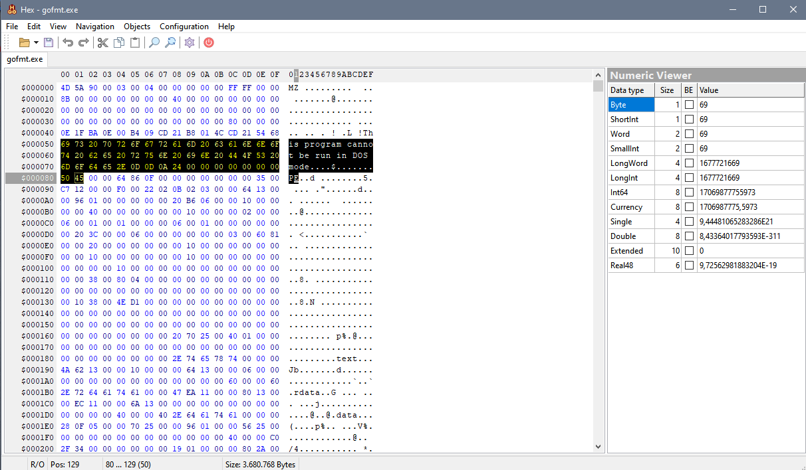

## Hex
Hex is a hexadecimal editor built on top of Free Pascal and Lazarus IDE, based on project of https://github.com/michalgw/mphexeditor.


<p></p>

* **Build**
```shell
$ lazbuild --build-mode=release Hex.lpi
```